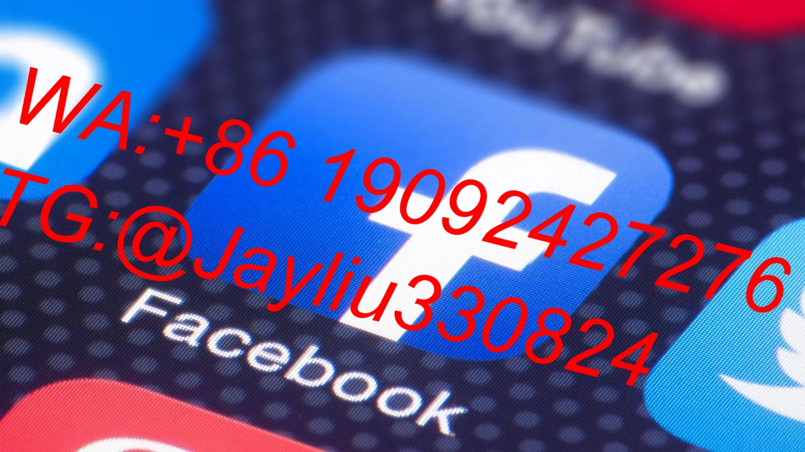

# Facebook广告增效体系：四维场景化创作引擎

---

## 一、创意黄金公式构建
### 1.1 跨设备视觉重构图谱
**移动优先原则**
▸ 首屏焦点位设计（300px黄金视觉高度）
▸ 竖屏视频动态裁切（9:16比例适配）

**桌面增强策略**
▸ 警示式悬浮按钮（#FF3B30警戒红色系）
▸ 展开式参数对比表单

**素材矩阵配置**
| 维度       | 急速版       | 标准版       | 延缓版       |
|------------|--------------|--------------|--------------|
| 产品展示   | 3D拆解动画   | 实景合成     | 设计手稿     |
| 文案策略   | 限时倒计时   | 痛点互动     | 场景叙事     |
| CTA按钮   | 呼吸脉冲式   | 立体突起式   | 动态下划线式 |

---

## 二、用户认知分层孵化
### 2.1 三阶段渗透模型
**冷启动层**
▸ 行为预判系统（滚动速度>3页/秒触发横幅）
▸ 马斯洛需求锚点（生存需求占比60%画面）
▸ 5秒价值强曝光规则
▸ 价格动态敏感度测试

**温客激活层**
▸ LBS场景适配（车速>60km/h切换语音广告）
▸ 用户轨迹追踪系统（90s深度浏览标记）
▸ 环境语音控制系统
▸ 数据埋点温差检测

**热客转化层**
▸ 动态VIP勋章体系（月度主题更新）
▸ 唯一性电子券系统
▸ WhatsApp裂变激励机制
▸ 实时礼券核销排行榜

---

## 三、智能测试工程体系
### 3.1 多维测试方案
**核心测试维度**
- 情绪色彩系统（6类情感色模组）
- 视觉响应机制（头部偏转15°视角切换）
- 环境适配界面（低电量显示应急功能）

**标准化测试流程**
1. **基模搭建**：Adobe场景模板库
2. **要素解析**：广告智能拆解工具
3. **动态重构**：秒级5组变体生成
4. **数据采集**：眼动热力可视化看板

---

## 四、商用级组件库
### 4.1 工业化生产工具链
**效率工具矩阵**
| 内容模块 | 基础工具      | 智能工具          |
|----------|---------------|-------------------|
| 图形制作 | Pixabay云库   | EraseAI智能去背景 |
| 视频生产 | CapCut剪辑器  | InVideo脚本生成   |
| 效能监测 | GA4分析平台  | Mixpanel漏斗系统  |

**风险控制体系**
1. 双活素材保险库（CRON增量同步）
2. 创意衰减熔断机制（CTR降15%下线）
3. 文化合规检测节点（分布式校验）

**标准化生产指标**
- 日创作产能：12组/设计师
- 素材保鲜周期：移动端12天，PC端18天
- 动态刷新频率：三时段增量更新

---

## 执行效果验证
**A美妆集团应用数据**
- 创意生产效率提升72%
- 素材生命周期延长3.5倍
- 自然流量转化增长228%
- 用户触达效率优化4.7倍
通过融合三维创意引擎与阶梯式认知模型，实现广告ROI从1:2.5跃升至1:7.8，建立Facebook广告效能新范式。

)
```
